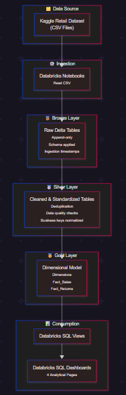

# 🛍️Retail and E-commerce Analytics Platform
## Project Overview
This project implements a modern data analytics platform for a retail and e-commerce business using Databricks platform.

## 📌Table of Contents

- [Project Overview](#project-overview)
- [Project Objectives](#project-objectives)
- [Tech Stack](#tech-stack)
- [Project Architecture](#project-architecture)
- [Medallion Architecture](#medallion-architecture)
- [KPI Metrics](#kpi-metrics)
- [Analytics and Dashboards](#Analytics-and-dashboards)
- [Future Enhancements](#future-enhancements)
- [Conclusion](#conclusion)

<h2 id="project-overview">🧩Project Overview</h2>
This project delivers an end-to-end Retail & E-Commerce Analytics Platform built on Databricks Lakehouse architecture. It transforms raw transactional data into analytics-ready datasets using a structured Bronze, Silver, and Gold data pipeline.

The platform focuses on data quality, scalability, and performance by applying data cleaning, standardization, and dimensional modeling techniques. Gold-layer fact and dimension tables enable meaningful business insights such as sales trends, customer behavior, product performance, and store-level analysis.

The final output supports interactive dashboards and KPI reporting, allowing stakeholders to make data-driven decisions efficiently.

<h2 id="project-objectives">🎯Project Objectives</h2>

- Build an end-to-end retail analytics platform using Lakehouse architecture.
- Ensure data quality, consistency, and traceability across all layers
- Design fact and dimension tables for business intelligence use cases
- Support real-time business insights using dashboards and KPIs

<h2 id="tech_stack">🧰Tech Stack</h2>

| Category             | Technology                         |
| -------------------- | ---------------------------------- |
| Programming Language | Python                             |
| Processing           | Apache Spark (PySpark)             |
| Platform             | Databricks (Community Edition)     |
| Storage              | Parquet / Delta Lake               |
| Data Architecture    | Lakehouse (Bronze / Silver / Gold) |
| Data Modeling        | Star Schema (Fact & Dimensions)    |
| Analytics            | Databricks SQL                     |
| Visualization        | Databricks Dashboards              |
| Version Control      | Git & GitHub                       |
| Data Source          | CSV Files                          |

<h2 id="project-architecture">🏗️Project Architecture</h2>

<h2 id="medallion-architecture">🧱Medallion Architecture</h2>

### 🟤Bronze Layer (Raw Data)
Purpose: Preserve raw data exactly as received.
- Data is ingested from CSV files
- No transformations or business logic applied
- Original column names and values retained
- Ingestion timestamp added for traceability

### ⚪Silver Layer (Cleaned & Standardized Data)
Purpose: Improve data quality and consistency.
- Invalid characters removed from column names
- Duplicates handled using business keys
- Null values standardized
- Text data trimmed and normalized
- Data types corrected
- Business rules applied

### 🟡Gold Layer (Analytics-Ready Data)
Purpose: Enable business reporting and insights.
- Dimensional modeling (Star Schema)
- Dimension tables and fact tables are created
- Surrogate keys used for joins
- Metadata columns for auditing
- Optimized for BI tools, KPIs, and dashboards.

<h2 id="kpi-metrics">📊KPI Metrics</h2>
The key performance indicators used to measure business performance and support data-driven decision-making. The KPIs are derived from Gold-layer fact and dimension tables and are visualized using dashboards.

Example KPI's:

- Total Sales Revenue - Overall revenue generated across all stores
- Yearly / Monthly Sales Trend – Sales performance over time
- Total Orders – Number of completed sales transactions
- Average Order Value (AOV) – Average revenue per order
- Customer Lifetime Value (CLV) – Total revenue contributed by a customer
- Top Performing Store – Store with the highest sales value
- Category Performance – Sales distribution across product categories

<h2 id="analytics-and-dashboards">📊Analytics & Dashboards</h2>
The Gold layer enables key business insights such as:

- Total and yearly sales trends
- Top and least performing stores
- Customer Lifetime Value (CLV)
- Product and category performance
- Sales vs returns analysis
- Gender and category-based customer insights
- Dashboards are built using Databricks SQL with KPI counters, bar charts, and trend visualizations.

<h2 id="future-enhancements">🚀Future Enhancements</h2>

- Implement Slowly Changing Dimensions (SCD Type 2) for full historical tracking
- Add real-time streaming ingestion using Auto Loader or Kafka
- Introduce data quality checks with automated validations
- Extend analytics with customer segmentation and forecasting
- Migrate dashboards to Power BI or Tableau
- Add alerting and monitoring for pipeline failures

<h2 id="conclusion">🏁Conclusion</h2>
This project demonstrates an end-to-end data engineering and analytics solution using modern Lakehouse principles.
By separating concerns across Bronze, Silver, and Gold layers, the platform ensures:

- High data quality
- Scalability
- Auditability
- Business-ready analytics

The solution is well-suited for real-world retail analytics use cases and can be easily extended for advanced reporting or machine learning applications.