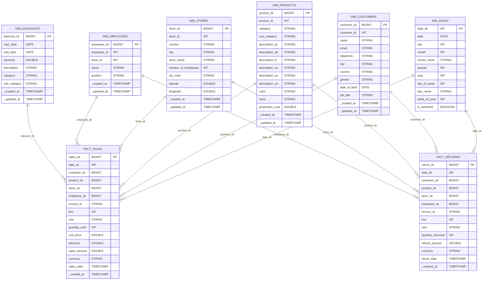

```mermaid
erDiagram

      DIM_CUSTOMERS{
      customer_sk BIGINT PK
      customer_id INT
      name STRING
      email STRING
      telephone STRING
      city STRING
      country STRING
      gender STRING
      date_of_birth DATE
      job_title STRING
      _created_at TIMESTAMP
      _updated_at TIMESTAMP
      }
  
      DIM_DATES{ 
      date_sk INT PK
      date DATE
      day INT
      month INT
      month_name STRING
      quarter INT
      year INT
      day_of_week INT
      day_name STRING
      week_of_year INT
      is_weekend BOOLEAN
      }
  
      DIM_DISCOUNTS{
      discount_sk BIGINT PK
      start_date DATE
      end_date DATE
      discount DOUBLE
      description STRING
      category STRING
      sub_category STRING
      _created_at TIMESTAMP
      _updated_at TIMESTAMP
      }
  
      DIM_EMPLOYEES{
      employee_sk BIGINT PK
      employee_id INT
      store_id INT
      name STRING
      position STRING
      _created_at TIMESTAMP
      _updated_at TIMESTAMP
      }  

      DIM_PRODUCTS{
      product_sk BIGINT PK
      product_id INT
      category STRING
      sub_category STRING
      description_pt STRING
      description_de STRING
      description_fr STRING
      description_es STRING
      description_en STRING
      description_zh STRING
      color STRING
      sizes STRING
      production_cost DOUBLE
      _created_at TIMESTAMP
      _updated_at TIMESTAMP
      }
  
      DIM_STORES{
      store_sk BIGINT PK
      store_id INT
      country STRING
      city STRING
      store_name STRING
      number_of_employees INT
      zip_code STRING
      latitude DOUBLE
      longitude DOUBLE
      _created_at TIMESTAMP
      _updated_at TIMESTAMP
      }
  
      FACT_RETURNS{
      return_sk BIGINT PK
      date_sk INT
      customer_sk BIGINT
      product_sk BIGINT
      store_sk BIGINT
      employee_sk BIGINT
      invoice_id STRING
      line INT
      size STRING
      quantity_returned INT
      refund_amount DOUBLE
      currency STRING
      return_date TIMESTAMP
      _created_at TIMESTAMP
      }
  
      FACT_SALES{
      sales_sk BIGINT PK
      date_sk INT
      customer_sk BIGINT
      product_sk BIGINT
      store_sk BIGINT
      employee_sk BIGINT
      invoice_id STRING
      line INT
      size STRING
      quantity_sold INT
      unit_price DOUBLE
      discount DOUBLE
      sales_amount DOUBLE
      currency STRING
      sales_date TIMESTAMP
      _created_at TIMESTAMP
    }

    %% Relationships – FACT_SALES
      DIM_DATES ||--o{ FACT_SALES : date_sk
      DIM_CUSTOMERS ||--o{ FACT_SALES : customer_sk
      DIM_PRODUCTS ||--o{ FACT_SALES : product_sk
      DIM_STORES ||--o{ FACT_SALES : store_sk
      DIM_EMPLOYEES ||--o{ FACT_SALES : employee_sk
      DIM_DISCOUNTS ||--o{ FACT_SALES : discount_sk

      %% Relationships – FACT_RETURNS
      DIM_DATES ||--o{ FACT_RETURNS : date_sk
      DIM_CUSTOMERS ||--o{ FACT_RETURNS : customer_sk
      DIM_PRODUCTS ||--o{ FACT_RETURNS : product_sk
      DIM_STORES ||--o{ FACT_RETURNS : store_sk
      DIM_EMPLOYEES ||--o{ FACT_RETURNS : employee_sk
```